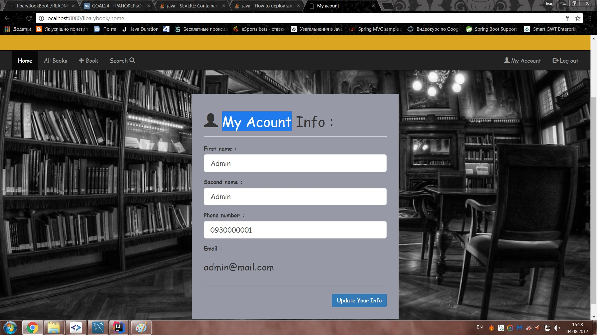
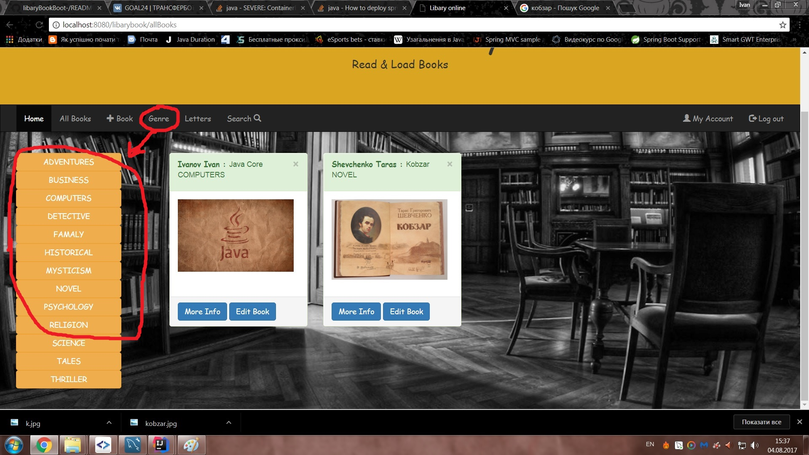
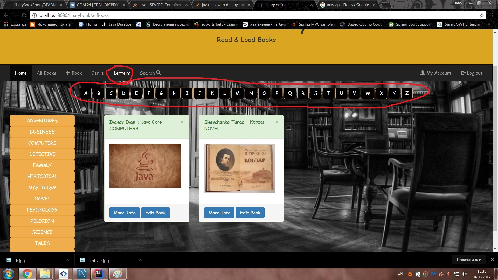
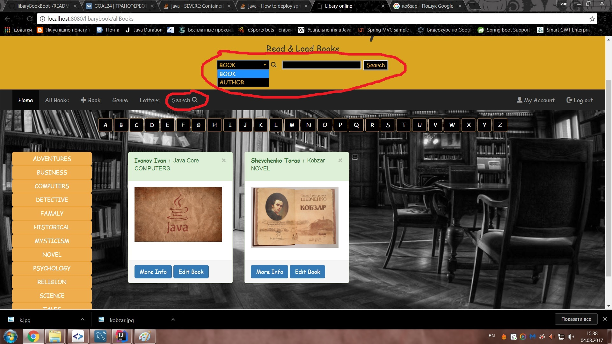
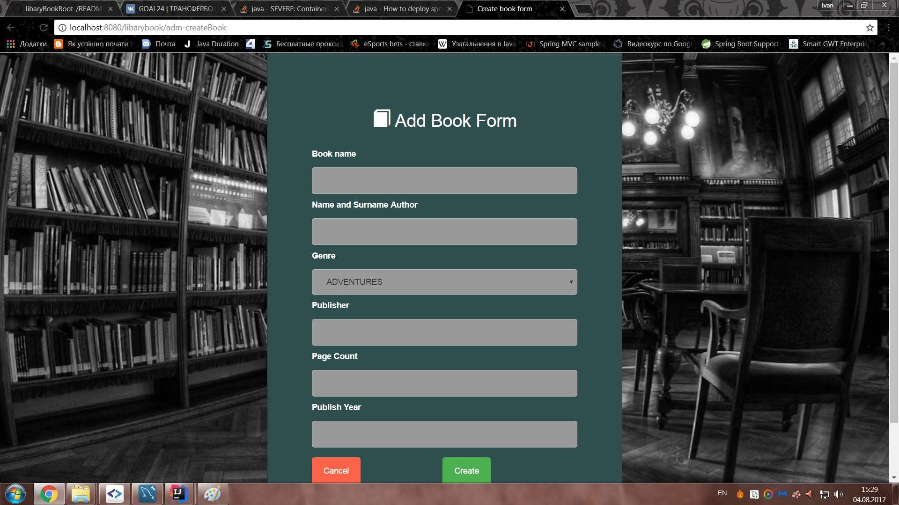
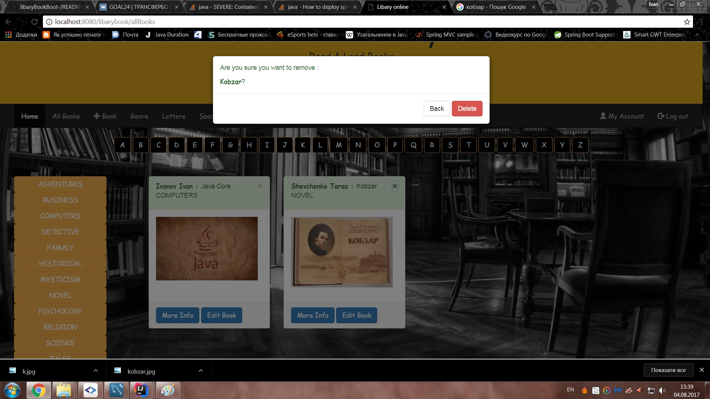
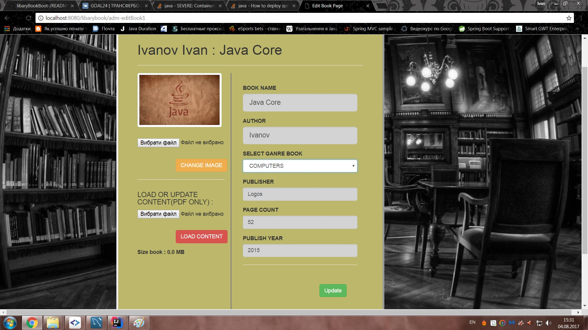
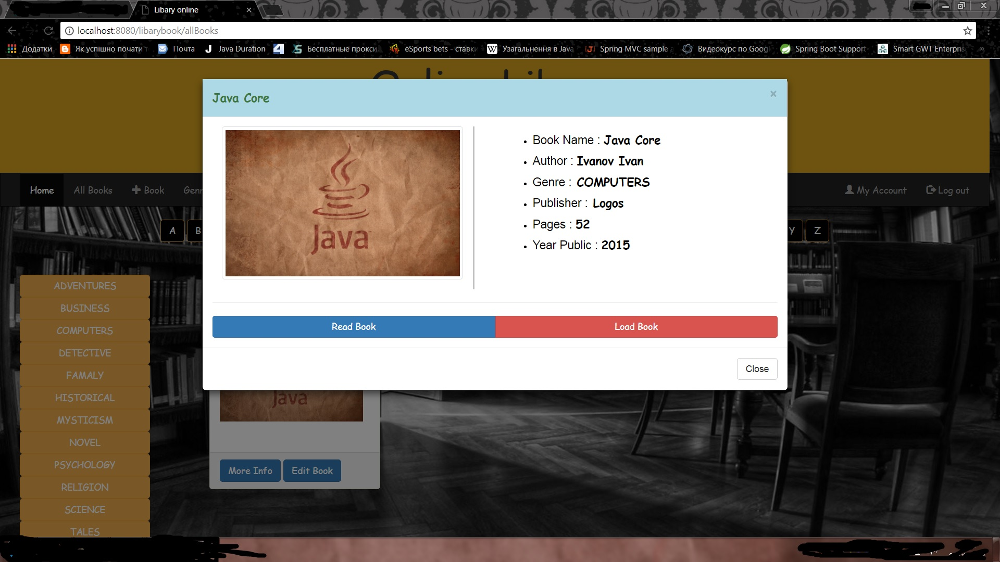

# libary Book
In this program you can read and load books in pdf format.
If you administrator you can add or delete books

# Login page
If you want to login as an administrator : 
login  :admin@mail.com  ; password : 123456;

# Registration form for users :

# An account where you can update information about yourself :

# A menu where you can choose a book :

# If you want to find a book by genre or by letter :

# Or you want find book by author or book title :

# Or if you administrator you can add,delete or update book
# add

# delete

# update

# In more info button you can read or load book

